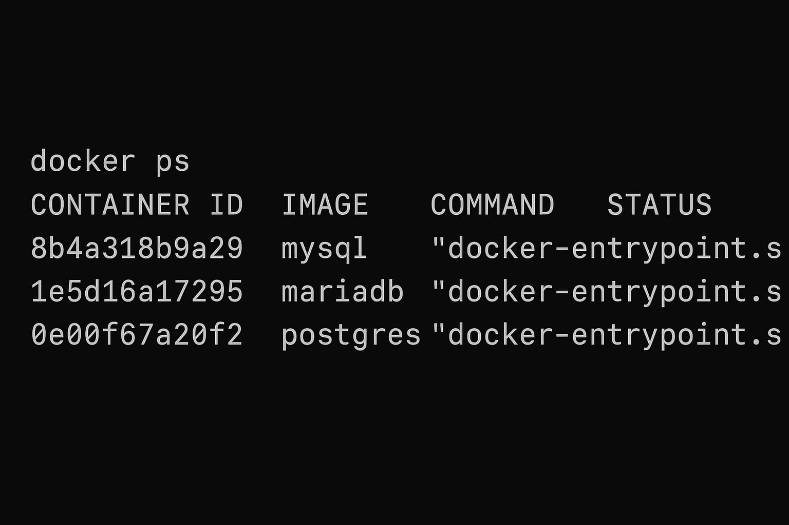
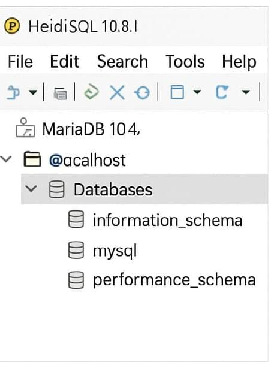
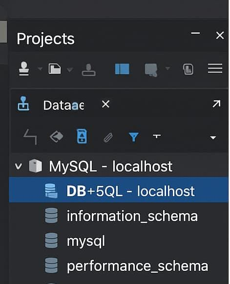

# Proyecto: Creacion y gestion de contenedores de bases de datos con Docker

---

## 1. Objetivo de la pra¡ctica

El objetivo de esta actividad es **crear, configurar y gestionar contenedores de bases de datos utilizando Docker desde la línea de comandos (CMD)**, verificando su funcionamiento mediante diferentes clientes SQL de escritorio.

---

## 2. Entorno de trabajo

| Herramienta | Descripcion | Version |
|--------------|-------------|----------|
| Docker Engine | Plataforma para crear y ejecutar contenedores | 27.1.1 |
| CMD / Terminal | Consola de Windows para ejecutar comandos Docker | Windows 11 |
| DBeaver | Cliente SQL grafico multiplataforma | 24.1.0 |
| HeidiSQL | Cliente SQL para MariaDB/MySQL | 12.0 |
| Beekeeper Studio | Cliente SQL para PostgreSQL | 4.0 |

---

## 3. Creacion de contenedores

Se levantaron tres contenedores independientes desde CMD, sin utilizar Docker Desktop ni Docker Compose.

| Contenedor | Imagen Docker | Puerto | Usuario | Contraseña |
|-------------|----------------|---------|-----------|-------------|
| MySQL | mysql:latest | 3306 | root | root |
| MariaDB | mariadb:latest | 3307 | root | root |
| PostgreSQL | postgres:latest | 5432 | postgres | root |

### Comandos utilizados

**MySQL**
```bash
docker run -d --name mysql_container -e MYSQL_ROOT_PASSWORD=root -p 3306:3306 mysql:latest
```

**MariaDB**
```bash
docker run -d --name mariadb_container -e MARIADB_ROOT_PASSWORD=root -p 3307:3306 mariadb:latest
```

**PostgreSQL**
```bash
docker run -d --name postgres_container -e POSTGRES_PASSWORD=root -p 5432:5432 postgres:latest
```

### Verificacion de contenedores activos
```bash
docker ps
```

**Evidencia:**  


---

## 4. Conexion desde clientes SQL

Cada base de datos fue conectada desde un cliente SQL diferente.

| Cliente | Base de datos | Host | Puerto | Usuario | Contraseña | Estado |
|----------|----------------|-------|---------|-----------|-------------|---------|
| DBeaver | MySQL | localhost | 3306 | root | root | Conectado |
| HeidiSQL | MariaDB | localhost | 3307 | root | root | Conectado |
| Beekeeper Studio | PostgreSQL | localhost | 5432 | postgres | root | Conectado |

**Evidencias:**  

  


---

## 5. Creacion de bases de datos

En cada contenedor se crearon tres bases de datos, una desde cada cliente SQL.

| Cliente | Contenedor | Base de datos creada | Resultado |
|----------|-------------|----------------------|------------|
| DBeaver | MySQL | db_dbeaver | Creada |
| HeidiSQL | MariaDB | db_heidisql | Creada |
| Beekeeper Studio | PostgreSQL | db_beekeeper | Creada |

**Evidencia:**  


## 6. Observaciones

- Docker permite ejecutar multiples bases de datos en contenedores aislados, evitando conflictos de puertos o dependencias.
- Los clientes graficos SQL facilitan la gestion visual y comprobacion de conexiones.
- Se comprobo la interoperabilidad entre contenedores Docker y herramientas externas de administracion.
- Esta practica refuerza el dominio de comandos Docker para gestion de servicios de base de datos.

---


## 7. Conclusiones

- Docker es una herramienta poderosa para ambientes de desarrollo y pruebas con bases de datos.  
- Se logro crear, ejecutar y conectar tres contenedores distintos sin interferencias.  
- Los resultados demuestran la eficiencia de Docker al simular entornos productivos locales.  
- El proceso completo puede ser replicado facilmente en otros equipos y sistemas operativos.

---

## 👨‍💻 Autor
*Nombre:* Juan Cuadros  
*Fecha:* Octubre de 2025  
*Proyecto:*  Creacion y gestion de contenedores de bases de datos con Docker

---
